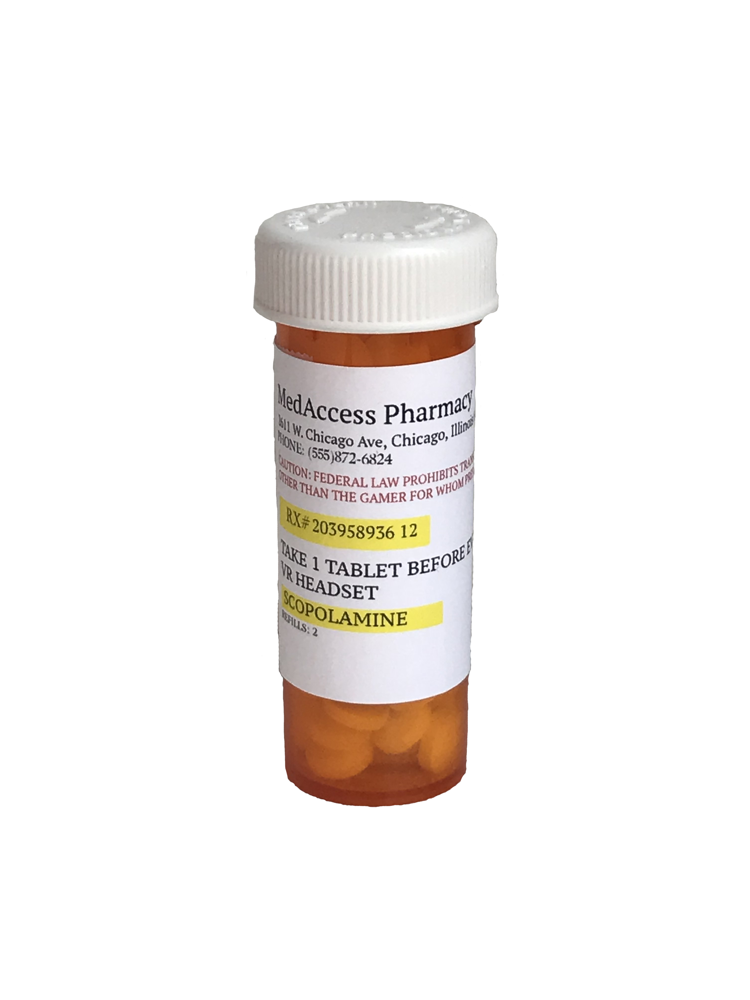
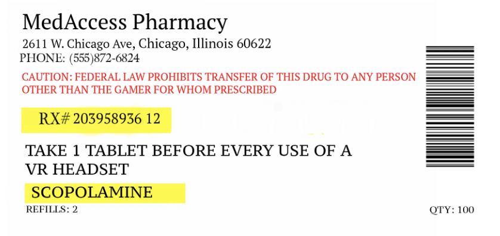

SCOPOLAMINE- PREVENTION FOR VR MOTION SICKNESS

Do you love virtual reality?  Are you prone to motion sickness? Now you can use virtual reality reality for long periods of time without feeling nauseous!  Take one pill 20 minutes before playing, and it will prevent you from experiencing any motion sickness for the next 8 hours.   

